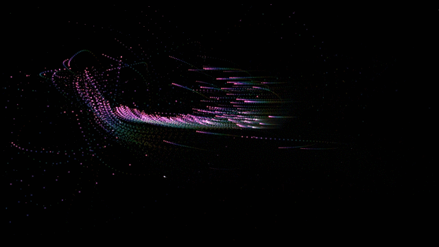

# JS_Gravity_Oscillator

 Randomly generated dots that are attracted to the cursor. Can change speed, size and saturation of dots. 

Exercise from O'Reilly HTML 5 Canvas (2nd Edition) 

Authors: Steve and Jeff Fulton

Updated: March 4, 2021

